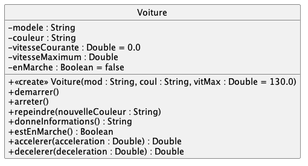

# exo1 > Voitures

Implémentez la classe suivante dans `src/main/kotlin/Voiture.kt` : 

> En UML, on ne peut pas préciser si les attributs sont muables (`var`) ou immuables (`val`). Il faut décider en fonction de la logique métiers des classes implémentées.
> 

La documentation des méthodes à implémenter est donnée plus bas.

Dans `src/test/koltin` vous avez des cas de tests validant votre code : commencez par valider **complètement** la traduction "Uml vers Kotlin" avant de passer à l'implémentation du corps des méthodes.

1. le fichier `TestUmlVoiture.kt` contient 18 cas de tests validant la traduction "Uml vers Kotlin"

		./gradlew test --tests TestUmlVoiture	
2.  le fichiers`TestUsageVoiture.kt` contient 12 cas de tests validant l'implémentation des méthodes :
une fois la traduction "Uml vers Kotlin" OK, renommer l'extension du  fichier `TestUsageVoiture.ktest` en `TestUsageVoiture.kt`

		./gradlew test --tests TestUsageVoiture

Tous les cas de tests doivent être OK.

Rappel pour compiler votre code, faites simplement 

	./gradlew classes

#### Documentation des méthodes de `Voiture`

- `demarrer()` -- Démarre la voiture

- `arreter()` -- Arrête la voiture ; passe instantanément la vitesse à 0.0

- `repeindre(nouvelleCouleur : String)` -- Repeint la voiture avec la nouvelle couleur, seulement si la voiture est arrêtée, sinon rien

- `donneInformations() : String` -- donne les informations concernant la voiture sous la forme d'une chaine de caractères ; Exemple : "Voiture Batmobile Tumbler de couleur noire"

- `estEnMarche() : Boolean` -- Renvoie true si la voiture est en marche, false dans le cas contraire

- `accelerer(acceleration : Double) : Double` -- Accélère la voiture de l'acceleration indiquée si la voiture est en marche, sans dépasser la vitesse maximum, ET renvoie la nouvelle vitesse de la voiture

- `decelerer(deceleration : Double) : Double` -- Ralentit la voiture si celle-ci est en marche, ET renvoie la nouvelle vitesse de la voiture
