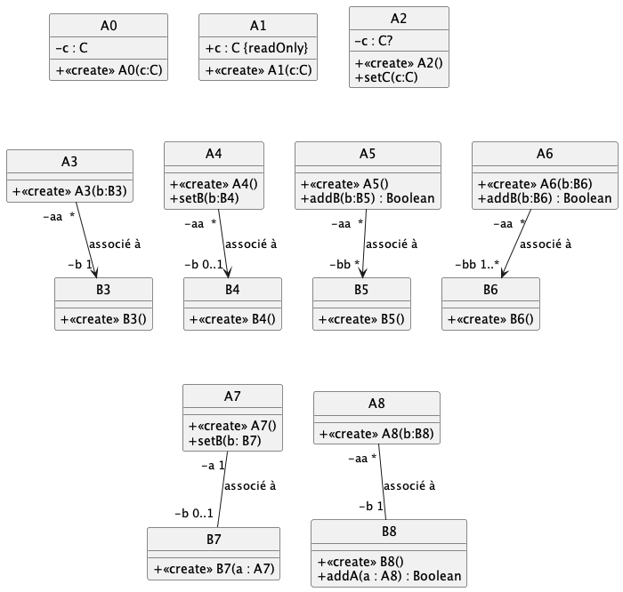

# Exo02 > à propos des associations (entre autre)

La traduction d'une association UML en Kotlin doit être sytématique. Implémentez les différentes *"situations"* décrites par les diagrammes UML suivants.

NB : les `*`, `0..*` ou `1..*` UML seront traduits par des `Array<X?>` de taille 10.

Des cas de tests sont donnés dans `test/kotlin/TestUmlabcXX.kt` validant chaque traduction.

Tout tester d'un seul coup vous conduit à beaucoup trop d'erreur 

	./gradlew test
	
Précisez plutôt la classe de tests que vous souhaitez exécuter 

	./gradlew test --tests TestUmlA0

 d