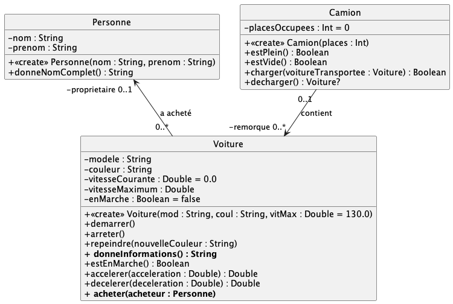

# exo3 > Voitures V2

Recopiez dans `src/main/kotlin/` la classe `Voiture.kt` implémentée dans l'**exercice 1**.

Complétez la classe `Voiture.kt` et implémentez les classes `Personne.kt`et `Camion.kt`pour refléter le diagramme de classes suivant :

La cardinalité `0..*` de l'association `contient` sera traduite par `Array<Voiture?>` pour l'attribut `remorque`. La taille de ce tableau sera fixée au nombre des places dans la remorque du camion (=paramètre du constructeur).

La documentation des méthodes à implémenter est donnée plus bas.

Comme précédemment des cas de tests sont donnés pour valider votre code ;   commencez par valider **complètement** la traduction "Uml vers Kotlin" avant de passer à l'implémentation du corps des méthodes
(comme précédement, `.ktest`-> `kt`au fur-et-à-mesure)

#### Documentation des méthodes

Dans la classe `Personne`

- `donneNomComplet()` -- retourne le prénom suivi d'un espace, suivi du nom en majuscule.

Dans la classe `Voiture`

- `acheter(acheteur : Personne)` -- Indique qu'une personne a acheté la voiture
 
- `donneInformations() : String` -- donne les informations concernant la voiture sous la forme d'une chaine de caractères ; Exemple :

        Voiture Batmobile Tumbler de couleur noire, propriété de Bruce WAYNE 
	
	si la voiture a été acheté par `Bruce WAYNE`, sinon
	
	
		 Voiture Batmobile Tumbler de couleur noire 

- La classe `Camion` fonctionne comme une *pile* ; on charge et on décharge les voitures dans l'ordre "premier chargé", "dernier déchargé". 

	Pour charger une voiture, il faudra qu'il y ait de la place et que la voiture ne soit pas déjà chargée.

