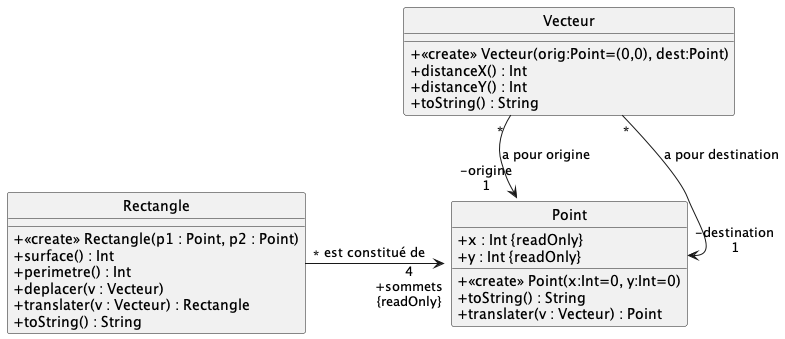

# Exercice 1

### Rappels Gradle

Pour compiler les sources Kotlin

	./gradlew classes

Pour exécuter (si nécessaire) la classe exécutable `MainKt`

	./gradlew run
	
Pour compiler les cas de tests fournis

	./gradlew testClasses		
	
Pour exécuter tous les cas de tests fournis

	./gradlew test	
	
> si la tâche de test termine, les détails de l'exécution des cas de test est consultables de manière détaillée dans [build/reports/tests/test/index.html](build/reports/tests/test/index.html)	
	
Pour exécuter une "classe" de cas de tests spécifique

	./gradlew test --tests TestXXXX

### Travail à faire

Le diagramme UML précédent illustre l'énoncé vu en TD précédemment : *un point est défini par son abscisse et son ordonnée. Un rectangle a quatre sommets qui sont des points. On construit un rectangle à partir de deux points uniquement. Il est possible de calculer sa surface et son périmètre, ou encore de le translater selon un vecteur. Un vecteur est constitué de deux points : source et destination.*

Commencez par implémenter le diagramme UML, sans vous occuper du corps des méthodes. Validez votre traduction via les cas de tests fournis dans `test/TestUmlXXX.kt`.

Une fois la traduction COMPLETEMENT **correcte**, implémentez le corps des méthodes et validez votre implémentation via `test/TestUsageXXX.kt`, à renommer (`XXX.ktest`-> `XXX.kt` afin qu'ils soient pris en compte)

#### Précisions concernant l'implémentation

- L'attribut `sommets` sera codé comme un `Array<Point>` de taille 4.
- Le constructeur de `Rectangle` prend **uniquement** 2 points en paramètre, il faut en déduire les 2 autres.
- Les méthodes `toString()` renvoie une chaine de caractères représentant l'objet.

	- pour un point p1 (0,1), 	`toString()` renverra `(0,1)`
	- pour un rectangle `toString()` renverra la liste des 4 points formant le rectangle sous cette forme `[(0,1)(0,3)(2,3)(2,1)]`
	- pur un vecteur (0,1)->(2,3), `toString()` renverra `|-(0,1)-(2,3)->`