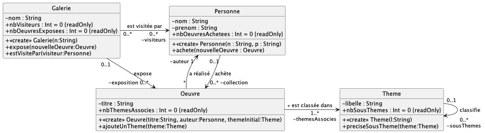

# Exercice 2

### Travail à faire

Le diagramme UML précédent illustre l'énoncé vu en TD précédemment : *Une galerie a des visiteurs et elle expose des oeuvres. Parmis les visiteurs de la galerie, certaines personnes achètent des oeuvres. Une oeuvre est réalisée par un artiste. Les oeuvres sont classées par thème/sous-thème. Une même personne peut être artiste et client d'une galerie.*

> Notez toutes les précisions apportées par rapport à la correction du TD papier ; ici, on a un diagramme de **conception détaillée**, où tous les choix d'implémentation ont été fait.
> 
> **Ex :** Les cardinalités UML `0..*` ou `1..*` seront 
> traduites en Kotlin par des `Array<>` de taille 10.
> On a donc ajouté des compteurs comme attributs, afin
> de se positionner "facilement" dans les tableaux.

1. Commencez par implémenter le diagramme UML, sans vous occuper du corps des méthodes. Validez votre traduction via les cas de tests fournis dans `test/TestUmlXXX.kt`.

2. Une fois la traduction COMPLETEMENT **correcte**, implémentez le corps des méthodes.

3. Dans la fonction `main()`  donnez un scénario, définissant des oeuvres, des personnes, une galerie, etc. et utilisez toutes les méthodes possible afin de vérifier que toutes les méthodes implémentées se comportent comme prévu.
