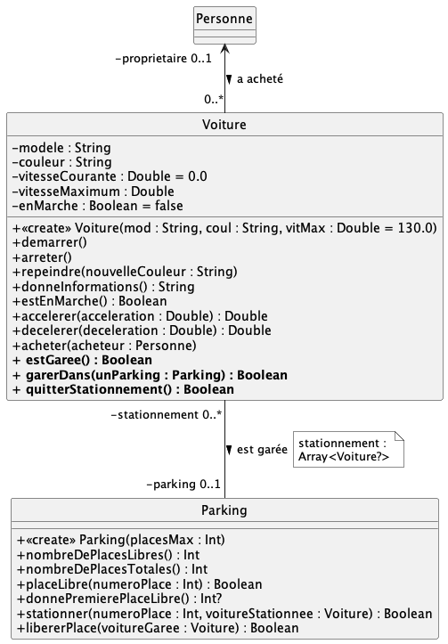

# Exercice 3

#### Préliminaire

Terminez l'exercice 3 du TPn°3.

#### Travail à faire

Comme indiqué sur le diagramme de classes (partiel) suivant, nous allons ajouter une notion de parking :

Une nouvelle classe `Parking` est a ajoutée, la classe `Voiture` doit être mise à jour.

Ajoutez  de nouveaux cas de tests présents dans `test/` dans le dossier `src/test/kotlin/` de l'exercice 3 du TP n°3. 

> Modifiez l'extension du fichier `TestUmlVoiture.kt` en `.ktest` afin qu'il ne soit plus pris en compte.

Implémentez déjà la structure UML puis occupez vous du corps des méthodes.

L'attribut `stationnement` sera de type `Array<Voiture?>`.

Les méthodes de `Parking` sont documentées ainsi :

- `nombreDePlacesLibres() : Int` -- donne le nombre de places disponibles dans le parking

- `nombreDePlacesTotales() : Int` -- donne le nombre de places totales du parking

- `placeLibre(numeroPlace : Int) : Boolean` -- indique si une place  repérée par son numéro est disponible ou non

- `donnePremierePlaceLibre() : Int?` -- donne la premiere place libre du parking ; renvoie  `null` si aucune place n'est libre

- `stationner(numeroPlace : Int, voitureStationnee : Voiture) : Boolean`  -- stationne la voiture à la place indiquée ; retourne `true` si c'est ok, `false` sinon

- `libererPlace(voitureGaree : Voiture) : Boolean` -- libère la place occupée par la voiture indiquée ;  retourne `true` si c'est ok, `false` sinon

> Dans le cas d'associations bi-directionnelles, comme ici "est garée", il faut assurer la cohérence des données des deux coté de l'association. Il faut qu'une des deux classes en ait la responsabilité. 

Ici ce sera la **voiture**, c-à-d que la voiture se chargera de modifier le parking pour que les données restent cohérentes des deux cotés de l'association.

Les nouvelles méthodes de `Voiture` sont documentées ainsi :

- `estGaree() : Boolean` -- indique si la voiture est garée

- `garerDans(unParking : Parking) : Boolean` -- stationne la voiture dans le parking indiqué et met à jour le parking en conséquence ; retourne `true` si c'est ok, `false` sinon

- `quitterStationnement() : Boolean`  -- indique que la voiture n'est plus stationnée et met à jour le parking en conséquence ; retourne `true` si c'est ok, `false` sinon

