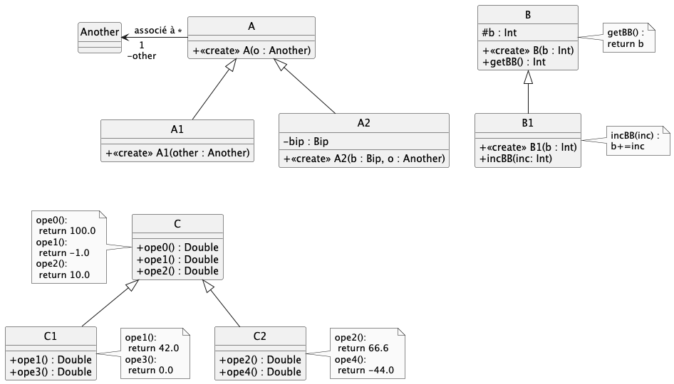

# dev.objets.tp5

> **Commencez par suivre le [tutoriel IntelliJ IDEA](https://gitlab.univ-nantes.fr/iut.info1.dev.objets/2024-2025/dev.objets.tutoriel.intellij.idea) si ce n'est pas déjà fait**

> **TP à réaliser OBLIGATOIREMENT sous IntelliJ IDEA**

Clonez ce dépôt depuis IntelliJ IDEA
(voir le
 [tutoriel IntelliJ IDEA > git](https://gitlab.univ-nantes.fr/iut.info1.dev.objets/2024-2025/dev.objets.tutoriel.intellij.idea/-/blob/main/tuto/git.md))

## Exercice 1 : les bases de l'héritage

1. Complétez les classes dans `exo1.*` pour correspondre aux situations décrites par le diagramme de classes précédent. 
Les fichiers source sont dans `src/main/kotlin/exo1/`.

> Des cas de tests sont donnés dans pour valider vos développements dans `src/test/kotlin/testexo1/`
>
> renommez au-fur-et-à-mesure les fichiers `.ktest` ; dans IntelliJ, faire `"clic droit"
Refactor > Rename...` pour modifier l'extension en `.kt`

2. Complétez le fichier `UseCMain.kt` en utilisant les classes `C`, `C1` et `C2` et exécuter ce fichier programme.

