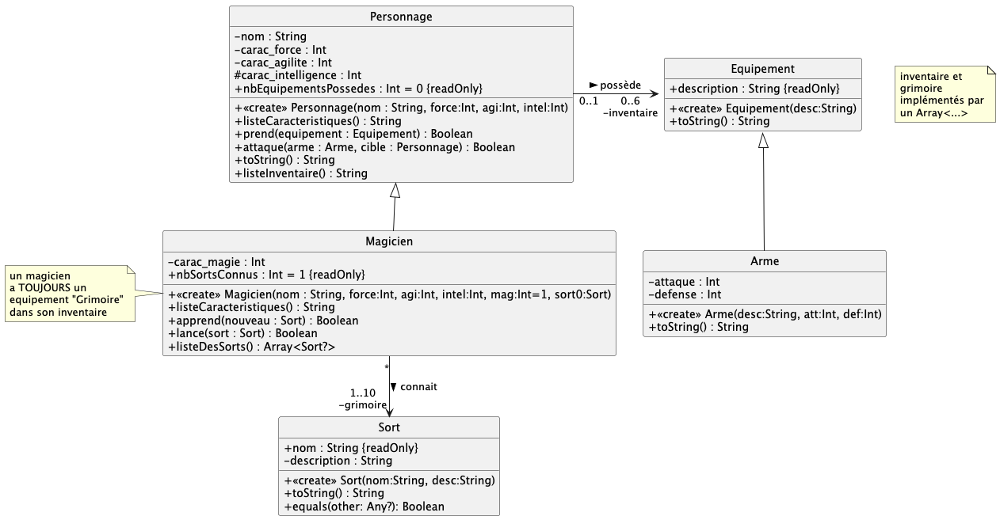

# dev.objets.tp6

> **TP à réaliser OBLIGATOIREMENT sous IntelliJ IDEA**

Commencez par cloner ce dépôt depuis IntelliJ IDEA
(voir le
tutoriel [IntelliJ IDEA > git](https://gitlab.univ-nantes.fr/iut.info1.dev.objets/2024-2025/dev.objets.tutoriel.intellij.idea/-/blob/main/tuto/git.md))

## Exercice 1 : personnage ou magicien

On reprend une variante du diagramme étudié lors du TD n°5.

### question 1 : implémentation de la structure des classes UML 

Complétez les classes dans `exo1.*` pour correspondre au diagramme de classes précédent, 
**sans vous occupez d'implémenter le corps des méthodes** = mettre `TODO()` comme corps des méthodes.

> Des cas de tests `testexo1/testUML*` sont donnés pour valider vos développements ; 
> renommez au-fur-et-à-mesure les fichiers `.ktest`

### question 2 : implémentation des méthodes

Focalisez-vous **maintenant** sur le corps des méthodes et les comportements attendus ; des précisions concernant
   certaines méthodes sont données ci-après

> Des cas de tests sont donnés pour valider vos développements dans `testexo1/TestsUsage.ktest` 
> à renommer correctement, au-fur-et-à-mesure

- `Equipement.toString()` : renvoie la description de l'équipement

- `Arme.toString()` : renvoie la description suivi de l'attaque et défense (ex : `Epee (5,2)`)

- `Sort.toString()` : renvoie le nom et la description du sort (ex : `Lumos : illuminer le bout de la baguette`)

- `Personnage.listeCaracteristiques()` : renvoie une chaine comme `FOR=4,AGI=5,INT=6`

- `Magicien.listeCaracteristiques()` : renvoie une chaine comme `FOR=3,AGI=3,INT=4,MAG=5`

- `Personnage.toString()` : renvoie une chaine comme `Conan <FOR=9,AGI=5,INT=1>`

- `Personnage.prend(equipement)`  : ajoute l'équipement à l'inventaire, si c'est possible (il n'est pas déjà présent et l'inventaire n'est pas plein) ; retourne `true` si l'ajout est ok

- `Personnage.attaque(arme,cible)` : affiche `attaque <CIBLE> avec <ARME>` si l'arme `<ARME>` est dans l'inventaire et retourne `true` ; retourne  `false` sinon

- `Personnage.listeInventaire()` : renvoie une chaine comme `Bourse - Epee (4,1) - Arc (6,0) - Corde - Bouclier (3,4) - `

- `Magicien.lance(sort : Sort)` : affiche `lance <NOM DU SORT>` si le sort est dans le grimoire et retourne  `true` ; retourne  `false` sinon

- `Magicien.listeDesSorts()` : renvoie un tableau contenant UNIQUEMENT les sorts présents dans le grimoire (sans case vide, donc)

### Question 3 : modification des constructeurs 

Modifiez l'implémentation du constructeur de `Personnage`
pour prendre en compte les _règles métier_ suivantes :
la somme des caractéristiques d'un personnage
doit toujours être égale à 15, et aucune caractéristique ne peut être
inférieure à 1 ; sinon,
les caractéristiques sont réparties équitablement (`FOR=5,AGI=5,INT=5`)

> Des cas de tests sont donnés pour valider vos développements dans `testexo1/TestsConstructeurs.ktest` à renommer correctement

Modifiez également l'implémentation du constructeur de `Magicien`
pour prendre en compte les `règles métier` suivantes : un personnage
a au moins 1 en magie et sa magie ne peut pas dépasser son intelligence
; sinon on fixe sa magie à 1

### Question 4 : utilisation des classes implémentées 

Dans `PersoMain.kt`, traduisez en code l'histoire suivante :

Imaginons deux aventuriers.

On a _Malicia_ une magicienne plutôt faible, très agile, très intelligente et vraiment très douée en magie :
(FOR=2,AGI6,INT=7,MAG=6). Elle a appris de nombreux sorts (voir `resources/sortsHP.csv`) : Dissendium, Enervatum,
Incarcerem, Oubliettes, Petrificus totalus, et Protego

Malicia est escorté par _Grog_ un barbare très très fort, 
moyennement agile mais vraiment pas malin (FOR=11,AGI=3,INT=1).

Ils vont s'équiper dans une échoppe _"Le bazar de l'aventure"_ : Malicia achète une épée (5,4), de la nourriture, un kit de soin, une dague (3,2) ainsi
qu'une amulette magique ; Grog, quand-à-lui achète uniquement une hache de bataille (10,6)

Malicia sort la première de la boutique. Elle tombe sur _Enrique le Flambayant_, 
un dangereux spadassin (FOR=5,AGI=7,INT=3) qui l'attaque aves sa rapière. 
Il porte la première attaque. Malicia se défend en lancant le sort
'Petrificus totalus' qui échoue ; 
Grog surgit alors et attaque également Enrique avec
sa hache de bataille.

# Exercice 2 : Messenger  

 Considérez une variante du diagramme étudié lors du TD n°5.

Donnez dans `exo2/` le code Kotlin correspondant.

> Des cas de tests `/testUML*` sont donnés dans `testexo2/` 
> 
> renommez au-fur-et-à-mesure les fichiers `.ktest`
