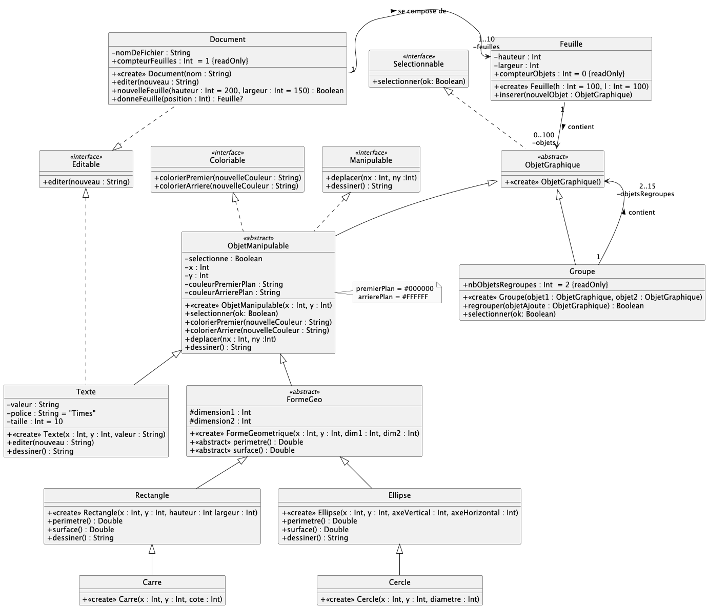
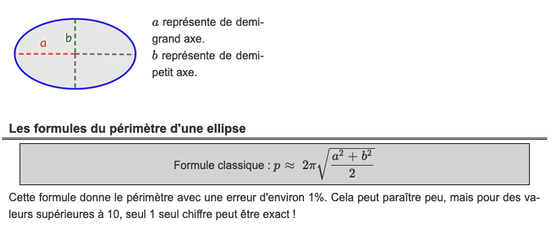

# dev.objets.tp7

_TP à réaliser sous IntelliJ._

Commencez par cloner ce dépôt depuis IntelliJ IDEA
(voir le
tutoriel [IntelliJ IDEA > git](https://gitlab.univ-nantes.fr/iut.info1.dev.objets/2024-2025/dev.objets.tutoriel.intellij.idea/-/blob/main/tuto/git.md))

Implémentez en Kotlin le diagramme de classe suivant :

> Quand on a affaire à un arbre d'héritage, il faut commencer par implémenter les classes-mères.

**Ordre conseillé pour implémenter les classes :**

1. `ObjetGraphique`, 
2. `ObjetManipulable`, puis, `FormeGeo`
3. `Rectangle` et `Ellipse`, puis `Carre` et `Cercle`
4. `Texte`
5. `Groupe`
6. `Feuille`
7. `Document`

> Renommez les cas de test `.ktest` -> `.kt` au fur-et-à-mesure.

`dessiner() : String` doit donner une chaine de caractères 
représentant toutes les caractéristiques de l'objet graphique 
considéré, comme suit :

    Texte(4,2,"totoro") => "totoro":X=4,Y=2,P=Times,S=10

    Rectangle(4,2,420,42) => [X=4,Y=2,H=420,L=42]
    
    Carre(4,2,42) => [X=4,Y=2,H=42,L=42]
    
    Ellipse(4,2,420,42) => (X=4,Y=2,AV=420,AH=42)
    
    Cercle(4,2,42) => (X=4,Y=2,AV=42,AH=42)

Pour le calcul du perimètre d'une ellipse, référez-vous au document suivant :

Pour l'aire, c'est plus simplement `PI * a * b`

(depuis [Calculis](https://calculis.net/perimetre/ellipse))
