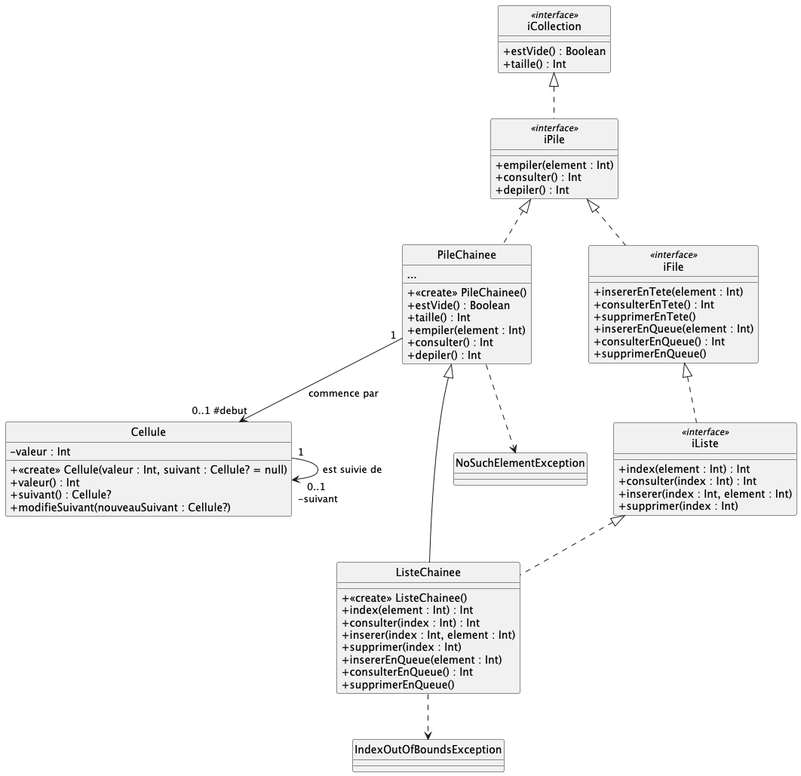

# dev.objets.tp9

Considérez le diagramme de classes suivant :

= version plus complète de l'exercice traité en TD.

> notez la présence des interfaces `iCollection`, `iPile`, `iFile` et `iListe`
> qui définissent les fonctionnalitées "attentues" 

### Implémentation de PileChainee

Implémentez la classe `PileChainee` qui construit une pile en utilisant
un chainage d'objets `Cellule`.

`PileChainee` doit réaliser `iPile`.

`consulter()` doit lever une exception `NoSuchElementException` ; dans quel cas ? 

`depiler()` doit lever une exception `NoSuchElementException` ; dans quel cas ?

La methode `taille()` peut-être implémentée plus ou moins efficacement : quelle est la solution la plus efficace ?

> Des cas de tests vous permettent de vérifier votre implémentation.
> Renommez les fichiers `.ktest` **nécessaire** en `.kt` pour tester l'usage de vos classes.

### Explication de iFile

L'interface `iFile` a quelque-chose de "déroutant" ; expliquez le ?

### Implémentation de  ListeChainee

Implémentez la classe `ListeChainee` héritant de `PileChainee`
qui construit une liste (et une file) en utilisant le même chainage 
d'objets `Cellule`.  

`ListeChainee` doit réaliser `iFile` ET `iListe`, et hériter de `PileChainee`.

`index(element: Int)`doit lever une exception `NoSuchElementException` ; dans quel cas ?

`consulter(index: Int)` doit lever une exception `IndexOutOfBoundsException` ; dans quel cas ?

`inserer(element: Int, index: Int)` doit lever une exception `IndexOutOfBoundsException` ; dans quel cas ?

`supprimer(index: Int)` doit lever une exception `IndexOutOfBoundsException` ; dans quel cas ?

> Des cas de tests vous permettent de vérifier votre implémentation.
> Renommez les fichiers `.ktest` **nécessaire** en `.kt` pour tester l'usage de vos classes.

Il n'est pas nécessaire de complètement réimplémenter les méthodes 

- `consulterEnQueue()`
- `insererEnQueue(element: Int)`
- `supprimerEnQueue()`

Comment faire mieux ?

> Des cas de tests vous permettent de vérifier votre implémentation.
> Renommez les fichiers `.ktest` **nécessaire** en `.kt` pour tester l'usage de vos classes.

